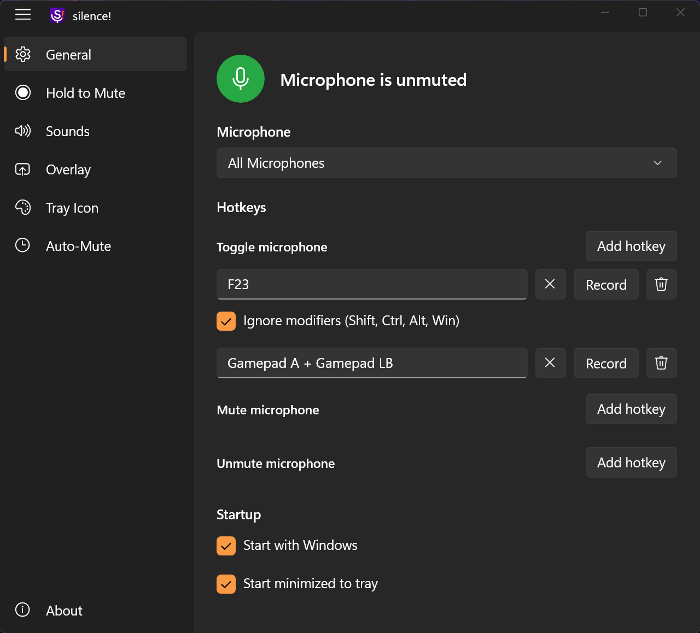
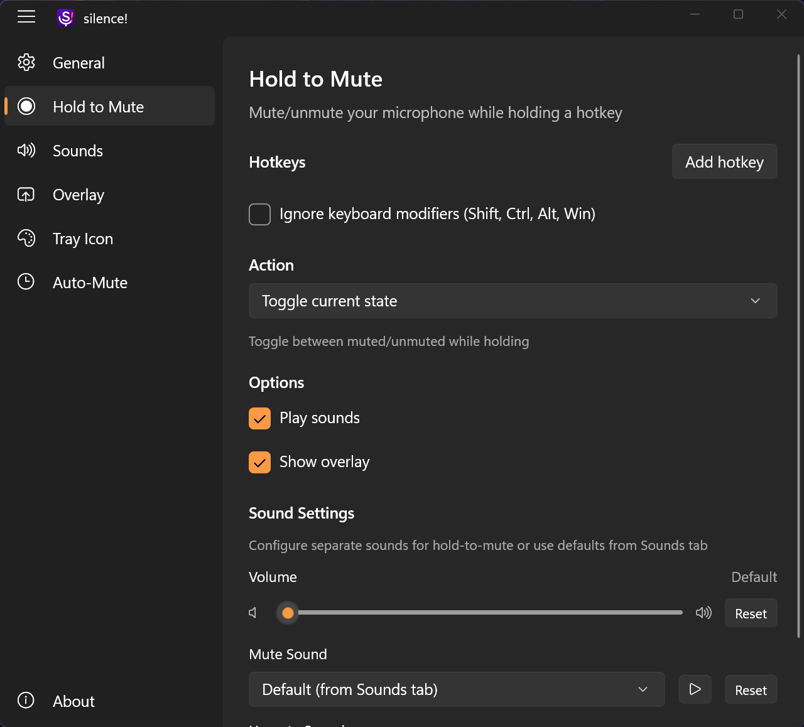
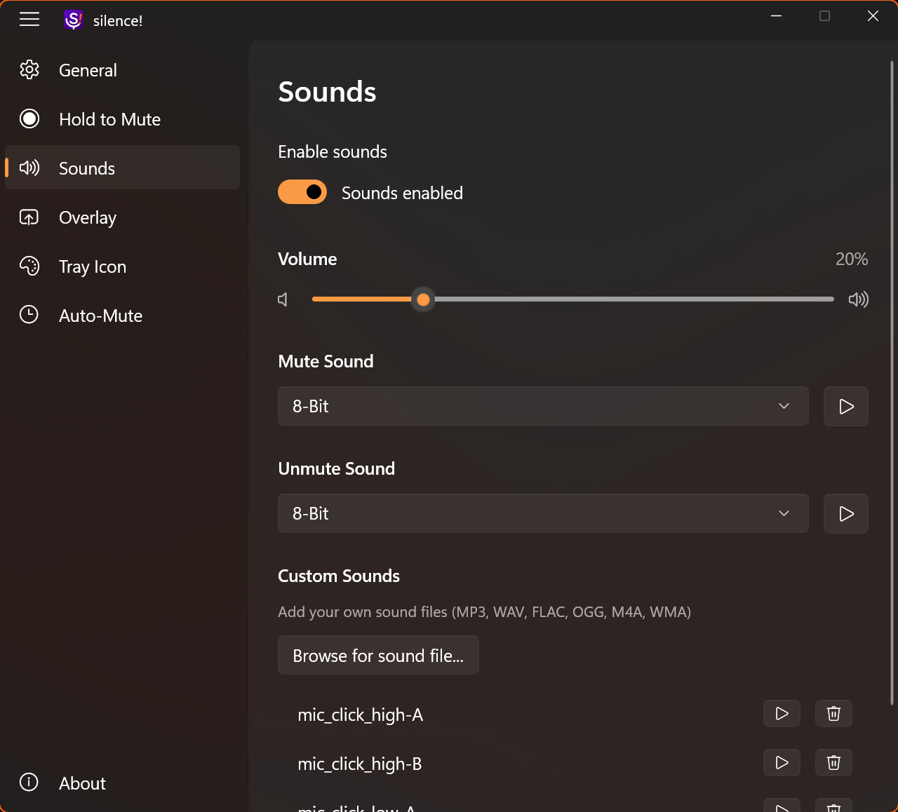
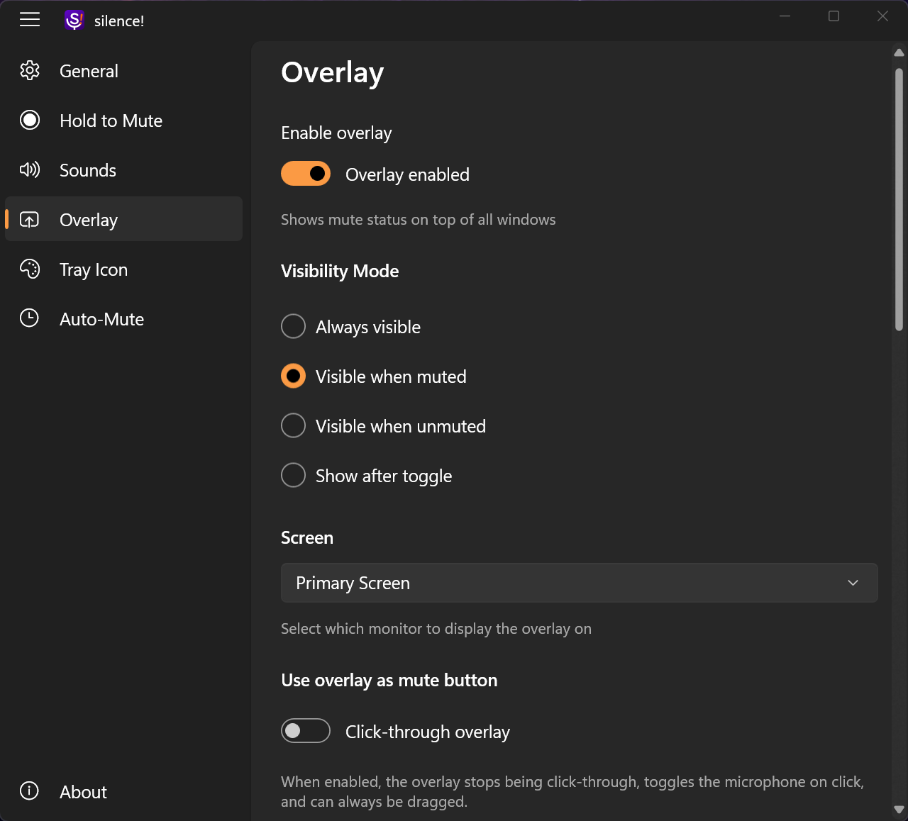
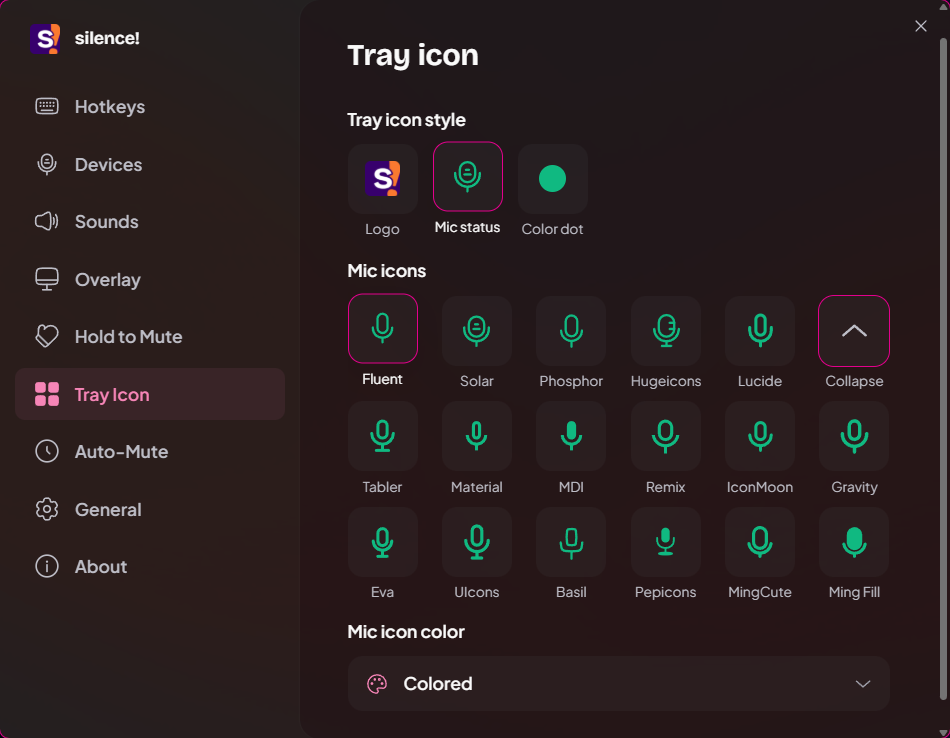
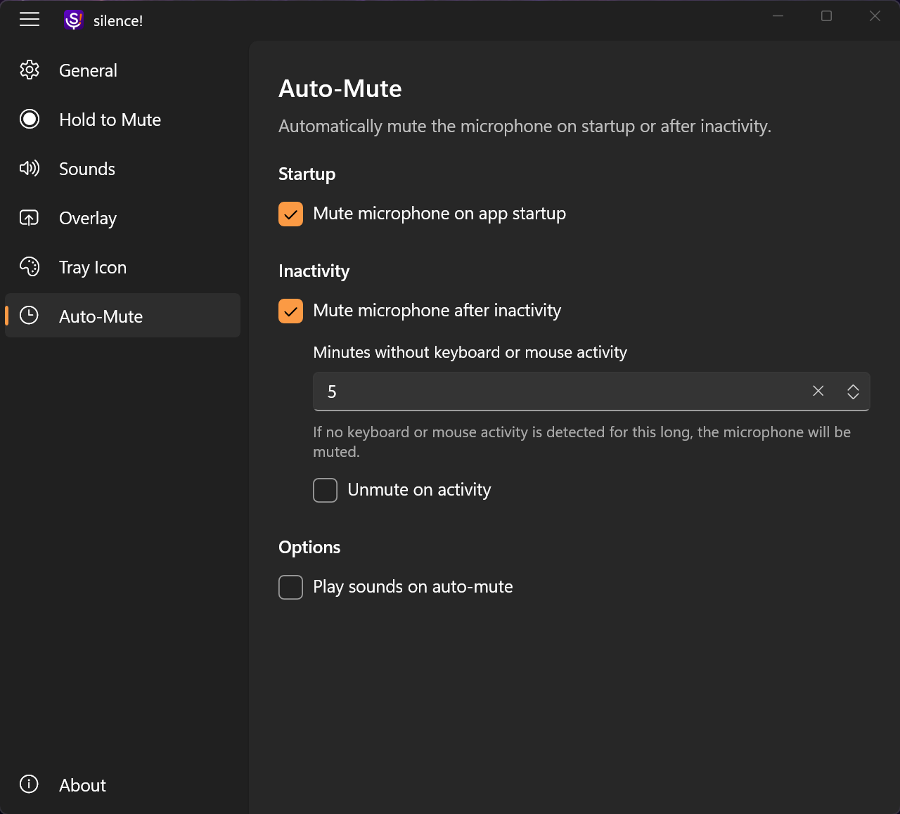

<p align="center">
  
</p>

<h1 align="center">silence!</h1>

<p align="center">
  <b>Free, open-source microphone mute control for Windows with global hotkeys, hold-to-talk, gamepad input, overlay feedback, and tray controls.</b>
</p>

<p align="center">
  <a href="https://silencemute.fun/">Website</a>
  |
  <a href="https://github.com/vertopolkalf/Silence-/releases">Download</a>
  |
  <a href="https://github.com/vertopolkalf/Silence-/issues">Issues</a>
</p>

<p align="center">
  
  
  
</p>

---

## Overview

`silence!` is a native Windows mic mute utility built for fast, reliable control from anywhere. Mute a specific microphone or all active microphones with keyboard, mouse, or gamepad input, then confirm the state with tray icons, sounds, and an on-screen overlay.

## Recent additions

- Gamepad hotkeys, combos, and hold-to-mute input
- Auto-mute on startup or after inactivity, with optional unmute on activity
- Multiple shortcuts per action, plus dedicated mute and unmute shortcuts
- Clickable overlay button mode and expanded overlay customization
- Tray icon style picker, live preview, and refresh-overlay control
- State sync and startup reliability fixes in the latest `v1.9.x` updates

## Features

### Input and mute control

- Multiple hotkeys per action for toggle, mute, and unmute
- Keyboard, mouse, modifier-only, and gamepad bindings
- Hold-to-mute, hold-to-unmute, or toggle-while-holding behavior
- Optional "ignore modifiers" matching for more flexible shortcuts
- Microphone selection with an `All Microphones` mode

### Feedback and customization

- Visual overlay with icon-only or icon-and-text modes
- Overlay visibility modes: always visible, muted only, unmuted only, or after toggle
- Clickable overlay mode that turns the overlay into an on-screen mute button
- Customizable overlay appearance, size, opacity, colors, and position
- Three tray icon styles: standard, filled circle, and dot
- Built-in sound themes plus custom audio files (`MP3`, `WAV`, `FLAC`, `OGG`, `M4A`, `WMA`)
- Separate sound behavior for toggle, hold, and auto-mute flows

### Everyday quality-of-life

- Start with Windows, launch minimized to tray, or start already muted
- Auto-mute after inactivity with optional auto-unmute on activity
- Left-click tray toggle for fast mute changes from the notification area
- Automatic update checks and in-app update flow
- English and Russian localization
- Native WinUI 3 interface with Windows 11 Mica and Windows 10 Acrylic styling

## Screenshots

| General and hotkeys | Hold to Mute |
| --- | --- |
|  |  |

| Sounds | Overlay |
| --- | --- |
|  |  |

| Tray icon styles | Auto-Mute |
| --- | --- |
|  |  |

## Installation

### Download a release

1. Open the [latest release](https://github.com/vertopolkalf/Silence-/releases/latest).
2. Pick the package for your architecture:
   - Installer: `silence-v<version>-x64-setup.exe`, `silence-v<version>-x86-setup.exe`, or `silence-v<version>-arm64-setup.exe`
   - Portable: `silence-v<version>-win-x64.zip`, `silence-v<version>-win-x86.zip`, or `silence-v<version>-win-arm64.zip`
3. Install it or extract the portable archive.
4. Launch `silence!.exe`.

No MSIX packaging is required.

### Build from source

Requirements:

- Windows 10 version 1809 (build `17763`) or later
- [.NET 8 SDK](https://dotnet.microsoft.com/download/dotnet/8.0)
- Visual Studio 2022 with the Windows application development workload

```powershell
git clone https://github.com/vertopolkalf/Silence-.git
cd Silence-
```

Then open `Silence!.sln` in Visual Studio, or publish the app with your preferred .NET / Windows App SDK workflow for `win-x64`, `win-x86`, or `win-arm64`.

## Contributing

Bug reports, feature requests, and pull requests are welcome.

## License

This project is open source and available under the [MIT License](LICENSE).
